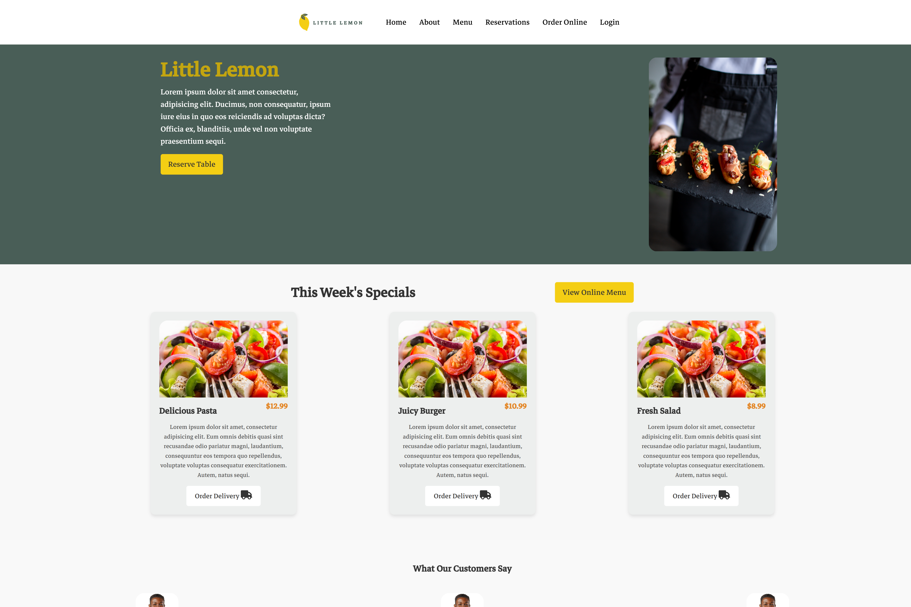
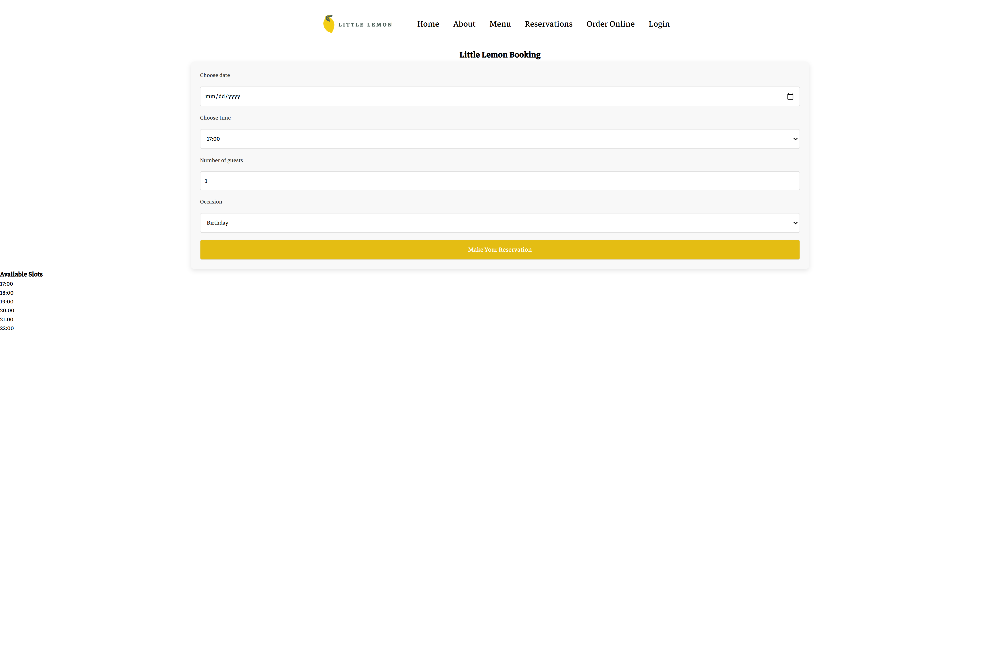

# Little Lemon Website (Meta Frontend Capstone Final Assignment)

This is the final capstone project for the **Meta Frontend Developer** course. The project is built using **React** with **Vite** and consists of two pages:

- **Home Page** (`http://localhost:5173/`)
- **Booking Page** (`http://localhost:5173/Booking`)

## 📸 Screenshots

### 🏠 Home Page


### 📅 Booking Page


## 📌 Features
- Responsive UI
- Navigation between Home and Booking pages
- React Router for page transitions


## 🛠️ Tech Stack
- **React** (Vite)
- **React Router**
- **CSS (Google Fonts & FontAwesome Icons)**

## 🚀 Getting Started

### 1️⃣ Install Dependencies
```sh
npm install
```

### 2️⃣ Run the Project
```sh
npm run dev
```

The app will be available at **`http://localhost:5173/`**.

---

